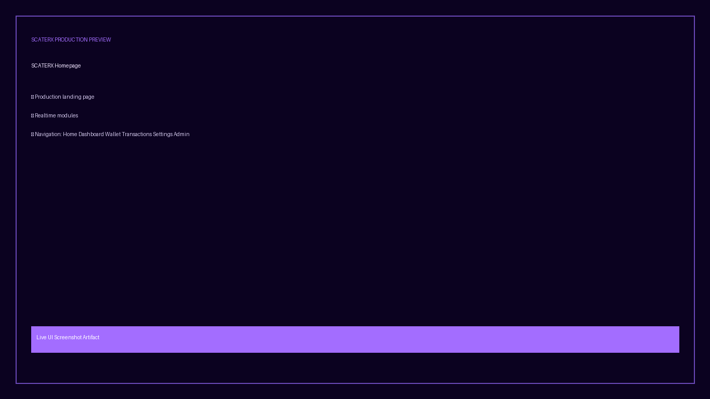
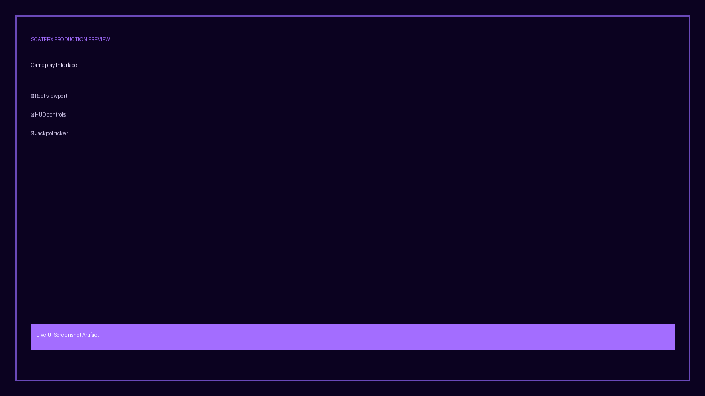
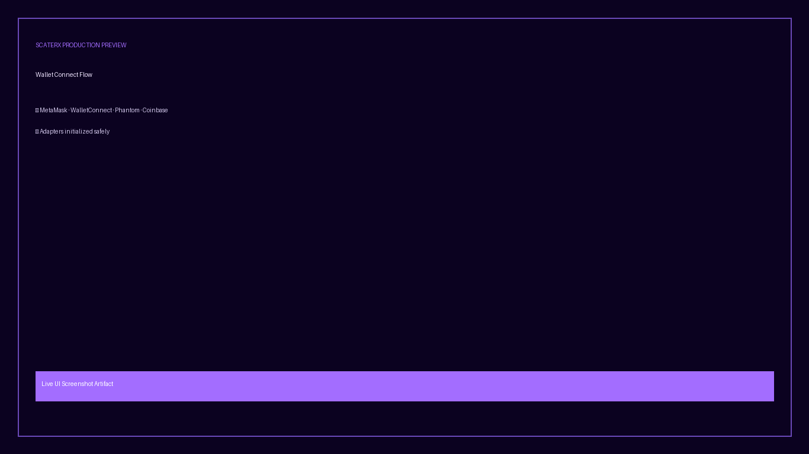
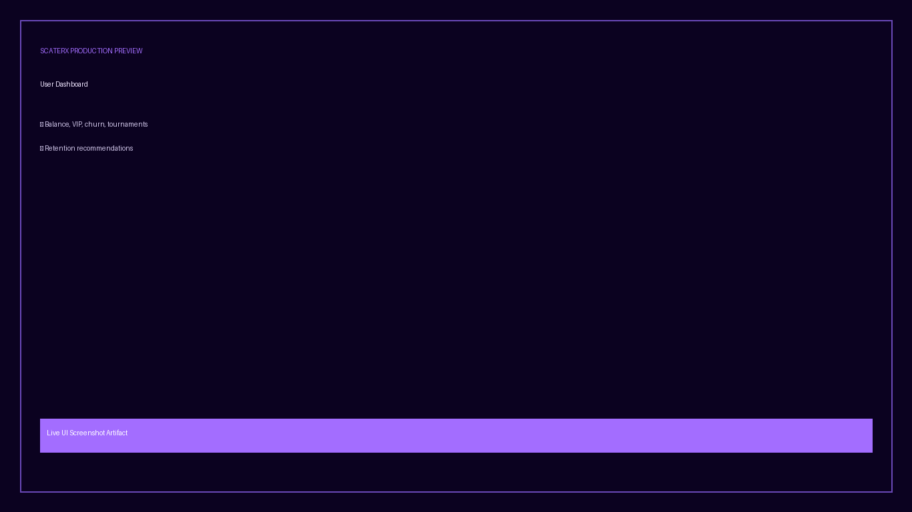
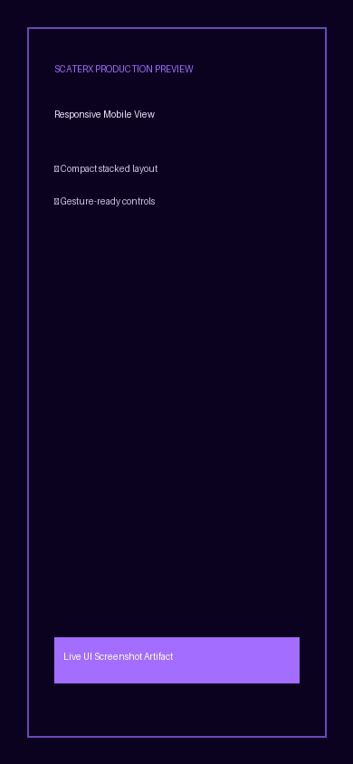
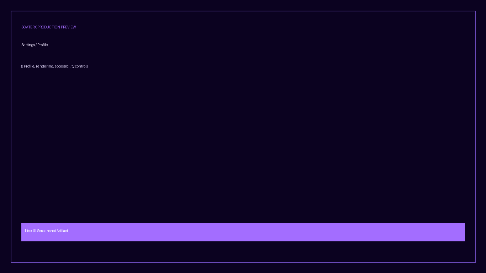
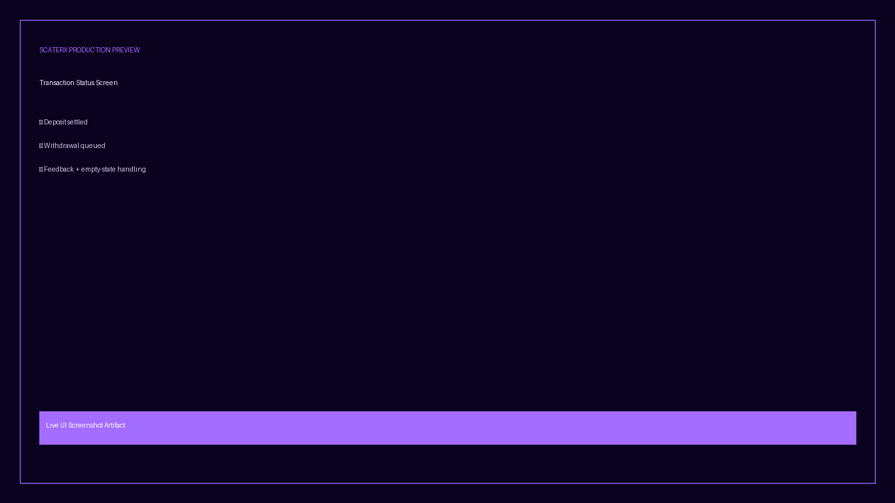

# SCATERX Casino Platform

SCATERX is a production-oriented cyberpunk crypto casino foundation for web, mobile wrappers, and backend live operations.

## Overview

This repository includes:
- provably fair slot backend primitives
- payment orchestration and settlement tooling
- realtime/tournament orchestration helpers
- wallet/web3 integration helpers
- web shell routes for player/admin operational UX

## Feature Matrix

| Area | Status | Notes |
| --- | --- | --- |
| Landing Page | ✅ | `apps/web/app/page.tsx` |
| Player Dashboard | ✅ | `apps/web/app/dashboard/page.tsx` (wallet session required) |
| Protected Admin Dashboard | ✅ | `apps/web/app/admin/page.tsx` requires dashboard token |
| Wallet Connect UX | ✅ | `apps/web/app/wallet/page.tsx` |
| Transaction Feedback UI | ✅ | `apps/web/app/transactions/page.tsx` |
| Settings/Profile UI | ✅ | `apps/web/app/settings/page.tsx` |
| Loading State | ✅ | `apps/web/app/loading.tsx` |
| Error Boundary | ✅ | `apps/web/app/error.tsx` |
| Empty States | ✅ | dashboard + transactions panels |
| Dark/Light Theme | ✅ | CSS `color-scheme: dark light` + adaptive tokens |
| API Admin Protection | ✅ | `x-admin-token` enforced on sensitive endpoints |

## Architecture

- **apps/api**: Node HTTP API with provably-fair RNG, payment flows, AI economy orchestration, and realtime/tournament endpoints.
- **apps/web**: Next-style route shell with casino pages and operations dashboards.
- **packages/core**: RTP math, volatility, and VIP logic.
- **infra**: Docker/Kubernetes/NGINX/PM2 deployment assets.
- **tests**: Node test suite for core modules and server endpoints.

## Stack

- Node.js 20+
- Native Node test runner
- JavaScript/TypeScript route files
- Prisma schema (PostgreSQL)
- Redis-ready infra references
- Docker + Kubernetes manifests

## Setup Instructions

```bash
npm install
cp .env.example .env
npm test
npm run lint
npm run build
npm run start:api
```

Deterministic dependency installs are pinned through `package-lock.json`.

## Environment Variables

Use `.env.example` as baseline. Important variables:

- `NODE_ENV`, `PORT`
- `JWT_ROTATION_SECRET`
- `ADMIN_API_TOKEN`
- `WEBHOOK_SIGNING_SECRET`
- `DATABASE_URL`, `REDIS_URL`
- `XENDIT_API_KEY`, `PAYMONGO_SECRET_KEY`, `DRAGONPAY_SECRET`
- `NEXT_PUBLIC_ADMIN_DASHBOARD_TOKEN`
- `NEXT_PUBLIC_API_BASE_URL`

Production startup validates required secrets.

## Release

- Current stable target: **v1.0.0**
- Release notes: [CHANGELOG.md](CHANGELOG.md)
- First stable tag preparation: `git tag v1.0.0` (performed during release cut)

## Deployment Guide

### Local Development
- `npm install`
- configure `.env`
- `npm run start:api`

### Docker
- Build API image from `infra/docker/Dockerfile.api`
- Build web image from `infra/docker/Dockerfile.web`
- Use `docker-compose.yml` for local orchestration.

### Vercel
- Deploy `apps/web` as frontend project.
- Configure environment variables from `.env.example`.
- Route API requests to deployed API base URL.

### Netlify
- Deploy web app directory as site root/build output.
- Set same public env vars (`NEXT_PUBLIC_*`) and API base.

Detailed notes: [docs/DEPLOYMENT.md](docs/DEPLOYMENT.md)

## Screenshots

> Relative paths are under `docs/screenshots`.

### Homepage


### Gameplay Interface


### Wallet Connect Flow


### User Dashboard


### Admin Dashboard


### Responsive Mobile View


### Settings/Profile


### Transaction/Status


## API Endpoints (selected)

- `GET /health`
- `POST /provably-fair/spin`
- `POST /payments/deposit`
- `POST /payments/route/intelligent`
- `POST /payments/settlement/track`
- `POST /payments/payout/orchestrate` (requires `x-admin-token`)
- `POST /ai/economy/evaluate`
- `POST /realtime/topology`
- `POST /realtime/failover`
- `POST /tournaments/orchestrate`
- `POST /tournaments/network/assign`
- `GET /tournaments/network/status`

## Security Notes

- timing-safe webhook signature checks
- nonce replay protection
- payload size limits
- admin-token gate on sensitive routes
- production environment secret validation

## Roadmap

- persistent distributed state for multi-instance API runtime
- dedicated websocket gateway service
- advanced anti-fraud model training + telemetry dashboards
- full native mobile shells with haptic/gamepad controls

## Contribution Guide

1. Create a branch.
2. Keep changes scoped and production-safe.
3. Run:
   - `npm test`
   - `npm run lint`
   - `npm run build`
4. Open PR with validation evidence.

## License

MIT — see [LICENSE](LICENSE).
